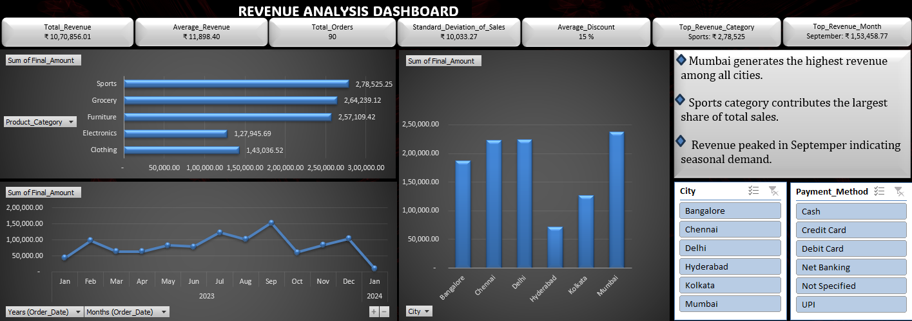

📊 Revenue Analysis Dashboard

📌 Project Overview
This project is an interactive Revenue Analysis Dashboard designed to analyze business performance using sales data. The dashboard provides insights into revenue trends, category performance, city-wise sales, and payment method distribution.

🚀 Key Features
Total Revenue & Average Revenue Metrics
Monthly Revenue Trend Analysis
Category-wise Revenue Distribution
City-wise Sales Comparison
Payment Method Analysis
Interactive Slicers for Dynamic Filtering
🛠 Tech Stack
Microsoft Excel
Pivot Tables
Pivot Charts
Slicers
Dashboard Design

📈 Key Insights
Sports category generated the highest revenue
Mumbai recorded the highest city-wise revenue
Revenue peaked in September
Credit Card payments were dominant

🎯 Learning Outcome
Through this project, I improved my skills in:
Data Cleaning
Data Visualization
Business Insight Generation
Dashboard Design

📷 Dashboard Preview

🔮 Future Improvements
Automate data refresh
Add Profit Analysis
Build Power BI version
